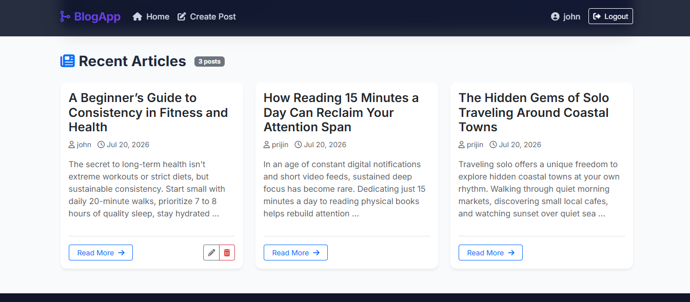
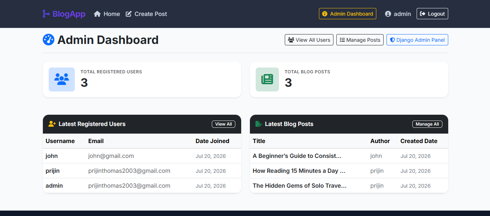
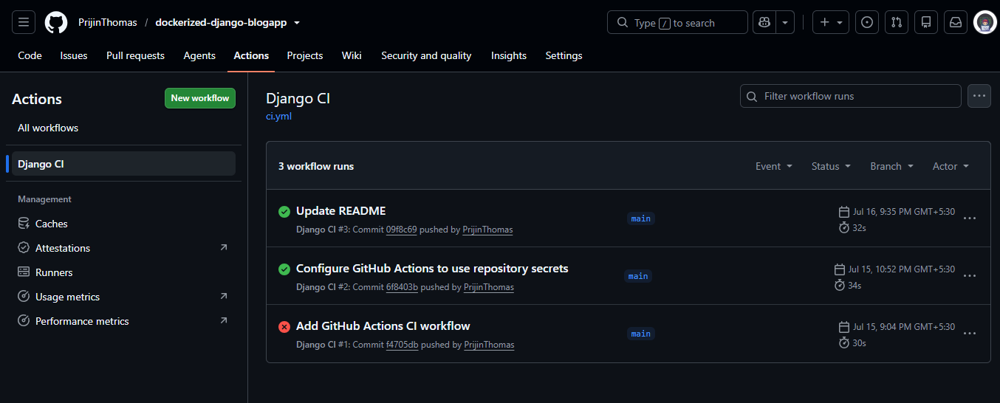
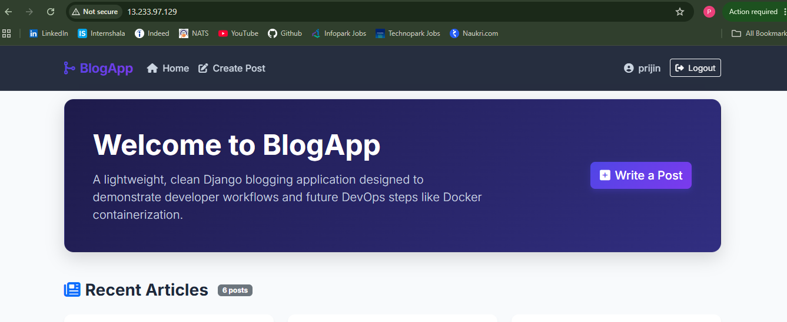
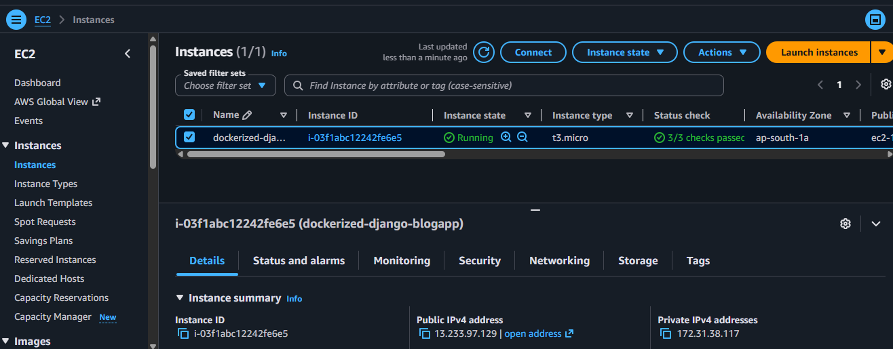

# Dockerized Django Blog Platform

A production-style Django blog platform built with **Docker**, **Docker Compose**, **MySQL**, **Gunicorn**, **Nginx**, **GitHub Actions**, and **AWS EC2**. This project demonstrates modern DevOps practices including containerization, reverse proxy configuration, automated CI pipelines, environment-based configuration, and cloud deployment.

---

## Features

### User Module
- User Registration
- User Login & Logout
- User Profile Page
- Authentication required for creating, editing, and deleting posts
- Users can only edit or delete their own posts

### Blog Module
- Home page displaying all blog posts
- Blog detail page
- Create, Edit, and Delete blog posts
- Django ModelForms
- Success and error flash messages

### Admin Module
- Django Admin Panel
- Custom staff-only Dashboard
- View total users and blog posts
- View latest registered users
- View latest blog posts
- Delete users and blog posts from the dashboard

### DevOps Features
- Dockerized Django application
- Multi-container architecture using Docker Compose
- MySQL database container
- Gunicorn WSGI application server
- Nginx reverse proxy
- Environment variable configuration using `.env`
- Automatic database migrations during container startup
- GitHub Actions Continuous Integration (CI)
- GitHub Secrets for secure environment management
- AWS EC2 deployment

---

# Architecture

```text
                      GitHub
                         │
               GitHub Actions (CI)
                         │
                         ▼
                 AWS EC2 (Ubuntu)
                         │
                  Docker Compose
                         │
        ┌────────────────┼────────────────┐
        │                │                │
     Nginx            Gunicorn         MySQL
        │                │
        └────────────► Django ◄───────────┘
                         │
                         ▼
                     Browser
```

---

# Tech Stack

## Backend

- Python 3.12
- Django 5.2

## Database

- MySQL 8.4

## Frontend

- HTML5
- CSS3
- Bootstrap 5
- Django Template Engine

## DevOps & Cloud

- Docker
- Docker Compose
- Gunicorn
- Nginx
- GitHub Actions
- GitHub Secrets
- AWS EC2
- Linux (Ubuntu 24.04)

---

# Project Structure

```text
dockerized-django-blogapp/
│
├── .github/
│   └── workflows/
│       └── ci.yml
│
├── accounts/
├── blog/
├── config/
├── nginx/
│   └── default.conf
├── static/
├── templates/
│
├── compose.yaml
├── Dockerfile
├── entrypoint.sh
├── manage.py
├── requirements.txt
├── .env.example
├── .gitignore
└── README.md
```

---

# Getting Started

## 1. Clone the Repository

```bash
git clone https://github.com/<your-username>/dockerized-django-blogapp.git

cd dockerized-django-blogapp
```

---

## 2. Create Environment File

Create a `.env` file in the project root.

Example:

```env
SECRET_KEY=your-secret-key

DEBUG=True

ALLOWED_HOSTS=localhost,127.0.0.1

DB_NAME=blogdb
DB_USER=bloguser
DB_PASSWORD=blogpassword
DB_HOST=db
DB_PORT=3306

DB_ROOT_PASSWORD=rootpassword
```

---

## 3. Build and Start Containers

```bash
docker compose up --build
```

The application will automatically:

- Build the Docker image
- Start the MySQL container
- Wait until MySQL is healthy
- Run Django migrations
- Start Gunicorn
- Start Nginx
- Serve the application

---

## 4. Access the Application

Open:

```
http://localhost
```

---

# Docker Services

| Service | Purpose |
|----------|---------|
| Nginx | Reverse Proxy |
| Gunicorn | WSGI Application Server |
| Django | Web Application |
| MySQL | Database |

---

# Environment Variables

| Variable | Description |
|----------|-------------|
| SECRET_KEY | Django Secret Key |
| DEBUG | Enable Debug Mode |
| ALLOWED_HOSTS | Allowed Hosts |
| DB_NAME | MySQL Database |
| DB_USER | MySQL Username |
| DB_PASSWORD | MySQL Password |
| DB_HOST | Database Host |
| DB_PORT | Database Port |
| DB_ROOT_PASSWORD | MySQL Root Password |

---

# Continuous Integration (CI)

This project includes a **GitHub Actions** workflow that automatically runs on every push and pull request to the `main` branch.

The pipeline performs:

- Repository checkout
- Environment file generation using GitHub Secrets
- Docker Compose validation
- Docker image build verification

This ensures the project builds successfully before deployment.

---

# Deployment

The application has been successfully deployed on **AWS EC2 (Ubuntu 24.04)** using:

- Docker Compose
- Nginx
- Gunicorn
- MySQL

> **Note:** If using a standard EC2 public IP (without an Elastic IP), the public IP changes after a Stop → Start operation. Update `ALLOWED_HOSTS` accordingly or configure an Elastic IP for a permanent address.

---

# DevOps Concepts Demonstrated

- Docker Image Creation
- Multi-Container Applications
- Docker Compose
- Docker Networking
- Docker Volumes
- Environment Variables
- GitHub Secrets
- GitHub Actions CI
- Continuous Integration
- Gunicorn WSGI Server
- Nginx Reverse Proxy
- MySQL Container
- Automatic Database Migration
- Health Checks
- Container Startup Automation
- AWS EC2 Deployment
- Linux Server Administration

---

# Future Improvements

- Continuous Deployment (CD) using GitHub Actions
- Docker Hub / Amazon ECR Integration
- HTTPS with Let's Encrypt
- Custom Domain Name
- Prometheus & Grafana Monitoring
- Kubernetes Deployment

---

# Screenshots

> Add screenshots after deployment.

```
screenshots/
├── home.png
├── login.png
├── dashboard.png
├── github-actions.png
└── aws-deployment.png
```

Example:

```markdown
## Home Page



## Admin Dashboard



## GitHub Actions



## AWS Deployment




```

---

# License

This project was developed for learning, portfolio, and DevOps practice purposes.

---

## Author

**Prijin Thomas**

MCA Graduate | Python Developer | DevOps Enthusiast | AWS & Docker Learner
